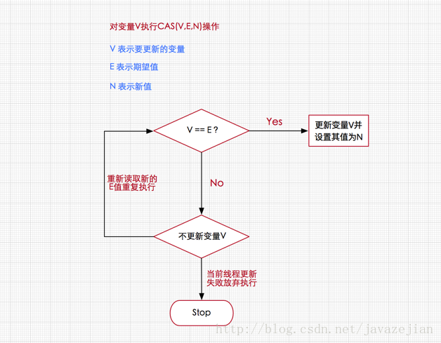

# 简介
> CAS 全拼为 `Compare And Swap` 比较和交换, 也有人理解为 `Compare And Set`比较和赋值
# 锁与共享变量
- 加锁是一种悲观的策略，它总是认为每次访问共享资源的时候，总会发生冲突，所以宁愿牺牲性能（时间）来保证数据安全。
- 无锁是一种乐观的策略，它假设线程访问共享资源不会发生冲突，所以不需要加锁，因此线程将不断执行，不需要停止。一旦碰到冲突，就重试当前操作直到没有冲突为止。
- 无锁的策略使用一种叫做比较交换的技术（CAS Compare And Swap）来鉴别线程冲突，一旦检测到冲突产生，就重试当前操作直到没有冲突为止。

<!--more-->

# CAS原理
执行函数：CAS(V，E，N)
```
V: 准备要被更新的变量
E: 期望值
N: 表示新值
```
V是共享变量，我们拿着自己准备的这个E，去跟V去比较，如果E == V ，说明当前没有其它线程在操作，所以，我们把N 这个值 写入对象的 V 变量中。如果 E ！= V ，说明我们准备的这个E，已经过时了，所以我们要重新准备一个最新的E ，去跟V 比较，比较成功后才能更新 V的值为N。



# ABA问题
## 问题
```
int a = 0;
Thread t1,t2,t3;
t1: a=1   cas(0,0,1)
t2: a=0   cas(1,1,0)
t3: a=1   cas(0,0,1)
```
在上方伪代码的情况下, 
1. 线程t1使用cas将a从0修改为1, 期望值为0(成立)
2. 线程t2使用cas将a从1修改为0, 期望值为1(成立)
3. 线程t3使用cas将a从0修改为1, 期望值为0(成立)

可以看到, 在 t3 进行对a进行修改的时候, a的值已经被t1,t2修改过了, 这就是aba问题

## 解决思路
解决办法很简单, 在cas的时候设置进去一个版本号, 用于记录. 每次修改都对版本号进行变更
```
CAS(V，E, version，N)
int a = 0;
Thread t1,t2,t3;
t1: a=1   cas(0,0,0,1)
t2: a=0   cas(1,1,1,0)
t3: a=1   cas(0,0,2,1)
```
这样在t3 进行修改的时候发现版本号不对, 修改失败.

# 无锁的效果
- 如果多个线程同时使用CAS操作一个变量的时候，只有一个线程能够修改成功。其余的线程提供的期望值已经与共享变量的值不一样了，所以均会失败。
- 由于CAS操作属于乐观派，它总是认为自己能够操作成功，所以操作失败的线程将会再次发起操作，而不是被OS挂起。所以说，即使CAS操作没有使用同步锁，其它线程也能够知道对共享变量的影响。
- 因为其它线程没有被挂起，并且将会再次发起修改尝试，所以无锁操作即CAS操作天生免疫死锁。
- 另外一点需要知道的是，CAS是系统原语，CAS操作是一条CPU的原子指令，所以不会有线程安全问题。

转自[无锁机制----比较交换CAS](https://blog.csdn.net/yanluandai1985/article/details/82686486)