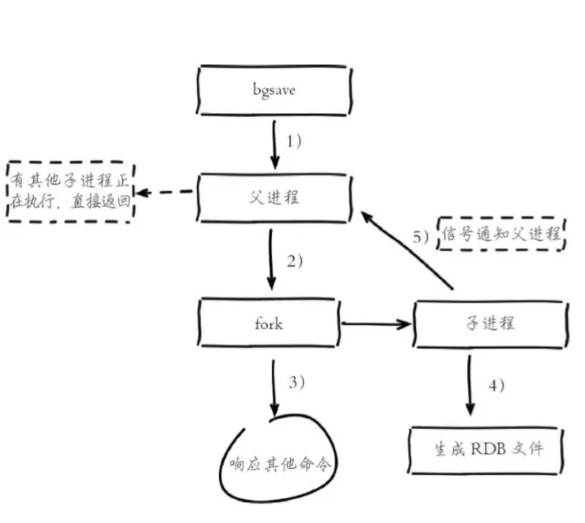
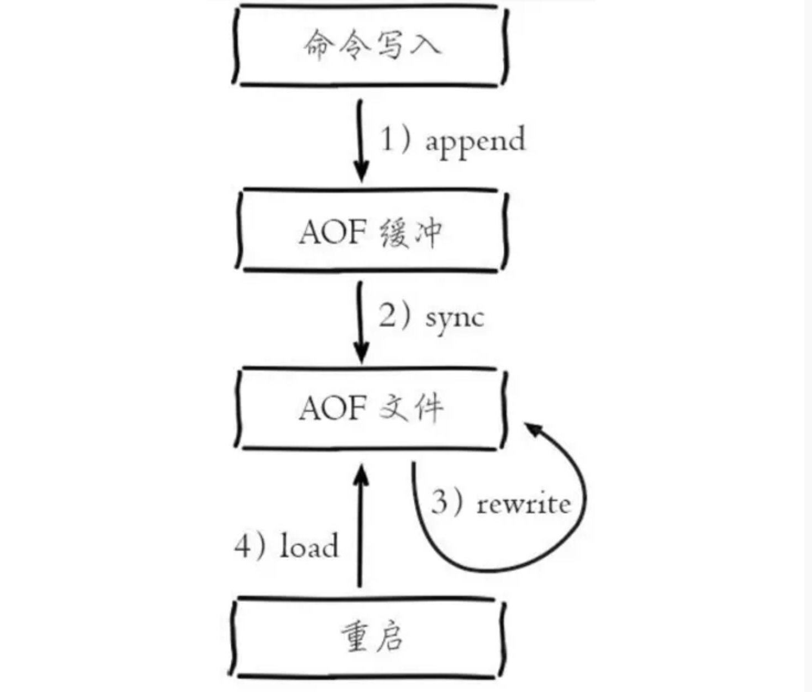
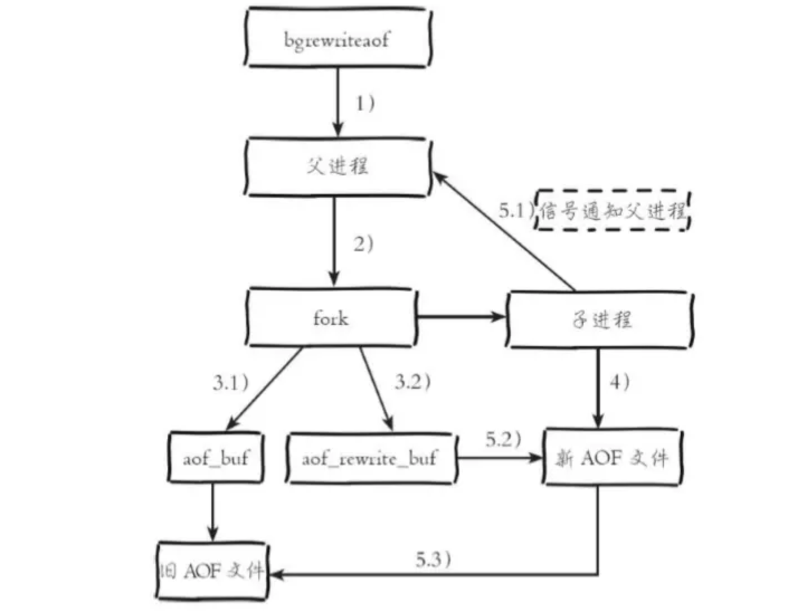
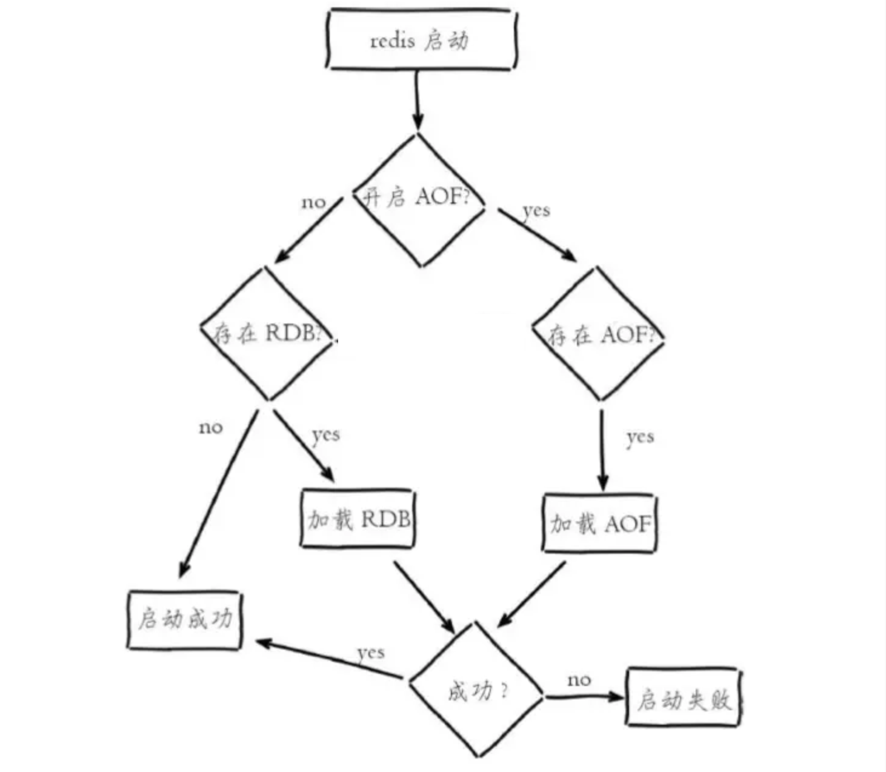

# 前言

> Redis支持RDB和AOF两种持久化机制，持久化功能有效地避免因进程退出造成的数据丢失问题，当下次重启时利用之前持久化的文件即可实现数据恢复。

# RDB(redis dataBase)
RDB持久化是把当前进程的数据转换成二进制文件生成快照保存到硬盘; 触发RDB持久化过程分为手动触发和自动触发 
## 触发机制
手动触发分别对应save和bgsave命令 

1. save命令: 阻塞当前Redis服务器，直到RDB过程完成为止，对于内存 比较大的实例会造成长时间阻塞，线上环境不建议使用 

2. bgsave命令: Redis进程执行fork操作创建子进程，RDB持久化过程由子 进程负责，完成后自动结束。阻塞只发生在fork阶段，一般时间很短 

<!--more-->

### 自动触发:save

1. 使用save相关配置，如“save m n”。表示m秒内数据集存在n次修改 时，自动触发bgsave。 

2. 如果从节点执行全量复制操作，主节点自动执行bgsave生成RDB文件并发送给从节点。 

3. 执行debug reload命令重新加载Redis时，也会自动触发save操作。 

4. 默认情况下执行shutdown命令时，如果没有开启AOF持久化功能则 自动执行bgsave。 

### 手动触发:bgsave
1. 执行bgsave命令，Redis父进程判断当前是否存在正在执行的子进 程，如RDB/AOF子进程，如果存在bgsave命令直接返回。 

2. 父进程执行fork操作创建子进程，fork操作过程中父进程会阻塞，通 过info stats命令查看latest_fork_usec选项，可以获取最近一个fork操作的耗时，单位为微秒 

3. 父进程fork完成后，bgsave命令返回“Background saving started”信息并不再阻塞父进程，可以继续响应其他命令。 

4. 子进程创建RDB文件，根据父进程内存生成临时快照文件，完成后 对原有文件进行原子替换。执行lastsave命令可以获取最后一次生成RDB的 时间，对应info统计的rdb_last_save_time选项。 

5. 进程发送信号给父进程表示完成，父进程更新统计信息，具体见 info Persistence下的rdb_*相关选项。 

## 优缺点
**优点:**
1. RDB是一个紧凑压缩的二进制文件，代表Redis在某个时间点上的数据 快照。非常适用于备份，全量复制等场景。比如每小时执行bgsave备份， 并把RDB文件拷贝到远程机器或者文件系统中（如hdfs），用于灾难恢复。 
2. Redis加载RDB恢复数据远远快于AOF的方式。 

**缺点:**  
1. rdb方式数据没办法做到实时持久化/秒级持久化。因为bgsave每次运 行都要执行fork操作创建子进程，属于重量级操作，频繁执行成本过高。 
2. RDB文件使用特定二进制格式保存，Redis版本演进过程中有多个格式 的RDB版本，存在老版本Redis服务无法兼容新版RDB格式的问题。 

# AOF(append-only file)
AOF持久化: 以独立日志的方式记录每次写命令， 重启时再重新执行AOF文件中的命令达到恢复数据的目的。AOF的主要作用 是解决了数据持久化的实时性，目前已经是Redis持久化的主流方式 

## 使用

1. 开启AOF功能需要设置配置: appendonly yes，默认不开启。
2. AOF文件名 通过appendfilename配置设置，默认文件名是appendonly.aof
3. 保存路径同 RDB持久化方式一致，通过dir配置指定。
4. AOF的工作流程操作: 命令写入 （append）、文件同步（sync）、文件重写（rewrite）、重启加载 （load）.
5. 所有的写入命令会追加到aof_buf（缓冲区）中. AOF缓冲区根据对应的策略向硬盘做同步操作。 

## 触发机制（根据配置文件配置项）
1. no：表示等操作系统进行数据缓存同步到磁盘（快，持久化没保证）
2. always：同步持久化，每次发生数据变更时，立即记录到磁盘（慢，安全）
3. everysec：表示每秒同步一次（默认值,很快，但可能会丢失一秒以内的数据）
4. AOF为什么把命令追加到aof_buf中？Redis使用单线程响应命令，如 果每次写AOF文件命令都直接追加到硬盘，那么性能完全取决于当前硬盘负 载。先写入缓冲区aof_buf中，还有另一个好处，Redis可以提供多种缓冲区同步硬盘的策略，在性能和安全性方面做出平衡 

## 重写
随着AOF文件越来越大，需要定期对AOF文件进行重写，达到压缩的目的。 

重写后的AOF文件为什么可以变小？有如下原因:  

1. 进程内已经超时的数据不再写入文件。 

2. 旧的AOF文件含有无效命令，如del key1、hdel key2、srem keys、set a111、set a222等。重写使用进程内数据直接生成，这样新的AOF文件只保留最终数据的写入命令。 

3. 多条写命令可以合并为一个，如: lpush list a、lpush list b、lpush list c可以转化为: lpush list a b c。为了防止单条命令过大造成客户端缓冲区溢 出，对于list、set、hash、zset等类型操作，以64个元素为界拆分为多条。 

AOF重写降低了文件占用空间，除此之外，另一个目的是: 更小的AOF 文件可以更快地被Redis加载 

AOF重写过程可以手动触发和自动触发:  

- 手动触发: 直接调用bgrewriteaof命令。 

- 自动触发: 根据auto-aof-rewrite-min-size和auto-aof-rewrite-percentage参数确定自动触发时机 

    - auto-aof-rewrite-min-size: 表示运行AOF重写时文件最小体积，默认 为64MB。 

    - auto-aof-rewrite-percentage: 代表当前AOF文件空间 （aof_current_size）和上一次重写后AOF文件空间（aof_base_size）的比值。 

    - 自动触发时机=aof_current_size>auto-aof-rewrite-minsize&&（aof_current_size-aof_base_size）/aof_base_size>=auto-aof-rewritepercentage 

    - 其中aof_current_size和aof_base_size可以在info Persistence统计信息中查看。 

## 恢复

## 优缺点
**优点:**
1. redis意外终止后可以保证只丢失1s的数据
2. 可以看到指令, 可读性强

**缺点:**
1. 生成aof日志文件过大
2. 恢复时间长 

# 开启混合持久化

> 4.0版本的混合持久化默认关闭的，通过aof-use-rdb-preamble配置参数控制，yes则表示开启，no表示禁用，5.0之后默认开启。

混合持久化是通过bgrewriteaof完成的，不同的是当开启混合持久化时，fork出的子进程先将共享的内存副本全量的以RDB方式写入aof文件，然后在将重写缓冲区的增量命令以AOF方式写入到文件，写入完成后通知主进程更新统计信息，并将新的含有RDB格式和AOF格式的AOF文件替换旧的的AOF文件。简单的说：新的AOF文件前半段是RDB格式的全量数据后半段是AOF格式的增量数据，
## 优缺点
**优点:** 混合持久化结合了RDB持久化 和 AOF 持久化的优点, 由于绝大部分都是RDB格式，加载速度快，同时结合AOF，增量的数据以AOF方式保存了，数据更少的丢失。

**缺点** 兼容性差，一旦开启了混合持久化，在4.0之前版本都不识别该aof文件，同时由于前部分是RDB格式，阅读性较差

# 注意事项
redis从rdb持久化切换为aof会导致之前的文件全部丢失, 需要先在redis控制台使用命令切换为aof生成aof文件, 然后退出,修改配置文件,再重新启动

> 部分摘抄自[Redis持久化](https://www.jianshu.com/p/d3ba7b8ad964)