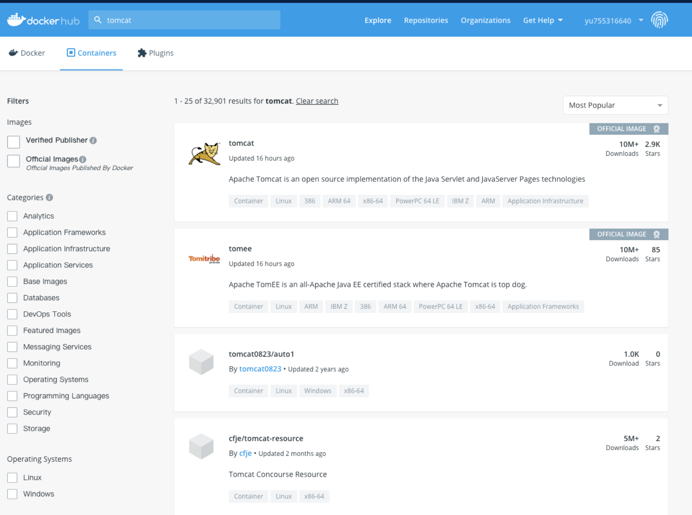
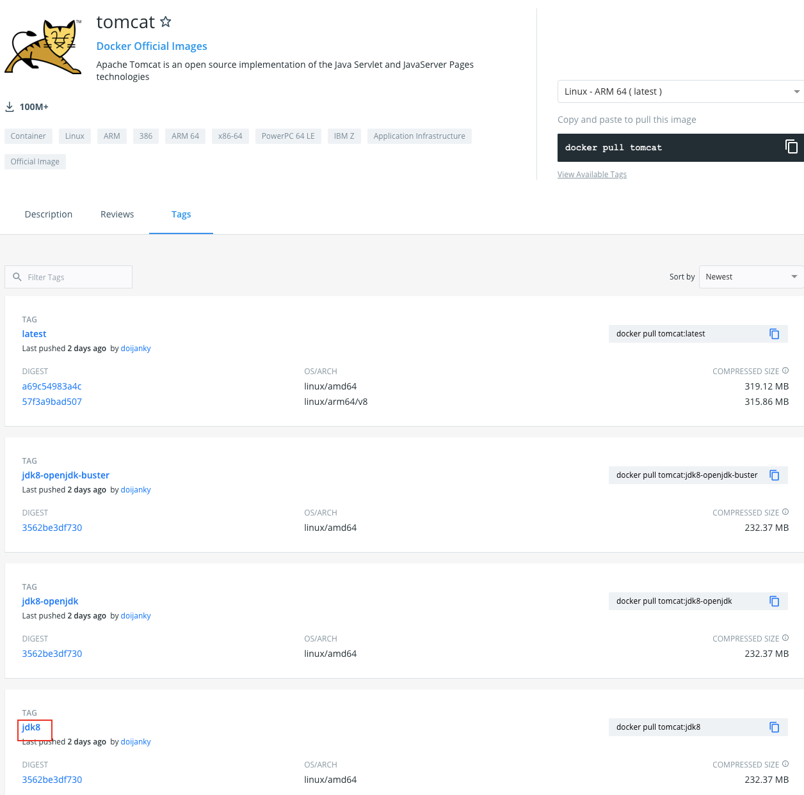
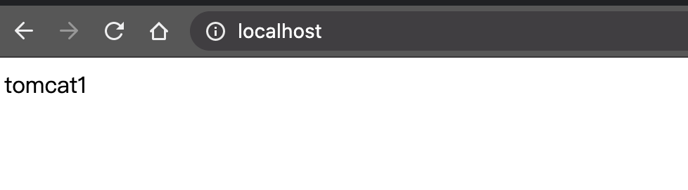

# 基本概念

> Docker 是一个虚拟环境容器，可以将你的开发环境、代码、配置文件等一并打包到这个容器中，并发布和应用到任意平台中。比如，你在本地用 Python 开发网站后台，开发测试完成后，就可以将 Python3 及其依赖包、Flask 及其各种插件、Mysql、Nginx 等打包到一个容器中，然后部署到任意你想部署到的环境。

- 镜像（Image）：类似于虚拟机中的镜像，是一个包含有文件系统的面向 Docker 引擎的只读模板。任何应用程序运行都需要环境，而镜像就是用来提供这种运行环境的。例如一个 Ubuntu 镜像就是一个包含 Ubuntu 操作系统环境的模板，同理在该镜像上装上 Apache 软件，就可以称为 Apache 镜像。
- 容器（Container）：类似于一个轻量级的沙盒，可以将其看作一个极简的 Linux 系统环境（包括 root 权限、进程空间、用户空间和网络空间等），以及运行在其中的应用程序。Docker 引擎利用容器来运行、隔离各个应用。容器是镜像创建的应用实例，可以创建、启动、停止、删除容器，各个容器之间是是相互隔离的，互不影响。注意：镜像本身是只读的，容器从镜像启动时，Docker 在镜像的上层创建一个可写层，镜像本身不变。
- 仓库（Repository）：类似于代码仓库，这里是镜像仓库，是 Docker 用来集中存放镜像文件的地方。注意与注册服务器（Registry）的区别：注册服务器是存放仓库的地方，一般会有多个仓库；而仓库是存放镜像的地方，一般每个仓库存放一类镜像，每个镜像利用 tag 进行区分，比如 Ubuntu 仓库存放有多个版本（12.04、14.04 等）的 Ubuntu 镜像。

<!--more-->

# 配置阿里镜像源

1. 登录容器镜像服务控制台后，在左侧导航栏选择镜像工具 > 镜像加速器，在镜像加速器页面就会显示为您独立分配的加速器地址。

```
例如：
加速器地址：[系统分配前缀].mirror.aliyuncs.com
```

2. 创建`/etc/docker/daemon.json`文件, 并写入:

```
{
"registry-mirrors": [""]
}
```

3. 重启 daocker

[官方文档](https://help.aliyun.com/document_detail/60750.html?spm=a2c4g.11186623.6.553.798e242f91hdh4)

# Docker 常用操作

输入`docker`可以查看 Docker 的命令用法，输入`docker COMMAND --help`查看指定命令详细用法。

## 镜像常用操作

查找镜像：

```
docker search 关键词
#搜索docker hub网站镜像的详细信息
```

下载镜像：

```
docker pull 镜像名:TAG
# Tag表示版本，有些镜像的版本显示latest，为最新版本
```

查看镜像：

```
docker images
# 查看本地所有镜像
```

删除镜像：

```
docker rmi -f 镜像ID或者镜像名:TAG
# 删除指定本地镜像
# -f 表示强制删除
```

获取元信息：

```
docker inspect 镜像ID或者镜像名:TAG
# 获取镜像的元信息，详细信息
```

## 容器常用操作

运行：

```
docker run --name 容器名 -i -t -p 主机端口:容器端口 -d -v 主机目录:容器目录:ro 镜像ID或镜像名:TAG
# --name 指定容器名，可自定义，不指定自动命名
# -i 以交互模式运行容器
# -t 分配一个伪终端，即命令行，通常-it组合来使用
# -p 指定映射端口，讲主机端口映射到容器内的端口
# -d 后台运行容器
# -v 指定挂载主机目录到容器目录，默认为rw读写模式，ro表示只读
```

容器列表：

```
docker ps -a -q
# docker ps查看正在运行的容器
# -a 查看所有容器（运行中、未运行）
# -q 只查看容器的ID
```

启动容器：

```
docker start 容器ID或容器名
```

停止容器：

```
docker stop 容器ID或容器名
```

删除容器：

```
docker rm -f 容器ID或容器名
# -f 表示强制删除
```

查看日志：

```
docker logs 容器ID或容器名
```

进入正在运行容器：

```
docker exec -it 容器ID或者容器名 /bin/bash
# 进入正在运行的容器并且开启交互模式终端
# /bin/bash是固有写法，作用是因为docker后台必须运行一个进程，否则容器就会退出，在这里表示启动容器后启动bash。
# 也可以用docker exec在运行中的容器执行命令
```

拷贝文件：

```
docker cp 主机文件路径 容器ID或容器名:容器路径 #主机中文件拷贝到容器中
docker cp 容器ID或容器名:容器路径 主机文件路径 #容器中文件拷贝到主机中
```

获取容器元信息：

```
docker inspect 容器ID或容器名
```

# docker 安装 tomcat

## 查找资源

```
 yuyu@localhost  ~/.ssh/temp  docker search tomcat
NAME                          DESCRIPTION                                     STARS     OFFICIAL   AUTOMATED
tomcat                        Apache Tomcat is an open source implementati…   2894      [OK]
tomee                         Apache TomEE is an all-Apache Java EE certif…   85        [OK]
dordoka/tomcat                Ubuntu 14.04, Oracle JDK 8 and Tomcat 8 base…   55                   [OK]
bitnami/tomcat                Bitnami Tomcat Docker Image                     37                   [OK]
kubeguide/tomcat-app          Tomcat image for Chapter 1                      29
consol/tomcat-7.0             Tomcat 7.0.57, 8080, "admin/admin"              17                   [OK]
cloudesire/tomcat             Tomcat server, 6/7/8                            15                   [OK]
aallam/tomcat-mysql           Debian, Oracle JDK, Tomcat & MySQL              13                   [OK]
```

`docker search tomcat` 命令可以查找到镜像对应的资源, 不过该命令不能显示镜像的详细信息, 我们下载的时候一般会加上`tag` 来确定版本信息, 这时需要到官网进行查询


查询列表中, 镜像名称规则为`username/镜像名称,`前如果不带有路径, 则代表是 docker 官方发布的镜像, 也通过右上角是否标识`OFFICIAL IMAGE`来区分. 找到对应的镜像查看明细信息,选择`tags`


如图红框标识的为 tag 名称, 用来区分版本号

## 下载

```
docker pull tomcat:jdk8
```

## 查看镜像信息

```
docker image ls
REPOSITORY   TAG       IMAGE ID       CREATED       SIZE
tomcat       jdk8      75dbb53610ac   2 days ago    534MB
```

## 启动

```
yuyu@localhost  ~  docker run --name tomcat1 -p 80:8080 -d tomcat:jdk8
4a026076de8805b0b3ee890d39474e2438cbfc15ea6a8ac5ebdfbb459cd39437
```

> `docker run` 命令如果没有找到本地镜像, 会先去官方镜像仓库拉取

## tomcat 配置主页

官方下载的 tomcat 默认是没有主页的, 我们需要先进行配置主页才可以通过浏览器访问

```bash
# 进入容器
yuyu@localhost  ~  docker exec -it tomcat1 /bin/bash
root@4a026076de88:/usr/local/tomcat# ls
BUILDING.txt  CONTRIBUTING.md  LICENSE	NOTICE	README.md  RELEASE-NOTES  RUNNING.txt  bin  conf  lib  logs  native-jni-lib  temp  webapps  webapps.dist  work
root@4a026076de88:/usr/local/tomcat# cd webapps
root@4a026076de88:/usr/local/tomcat/webapps# pwd
/usr/local/tomcat/webapps
root@4a026076de88:/usr/local/tomcat/webapps# mkdir ROOT
root@4a026076de88:/usr/local/tomcat/webapps# cd ROOT/
root@4a026076de88:/usr/local/tomcat/webapps/ROOT# echo 'tomcat1' > index.html
root@4a026076de88:/usr/local/tomcat/webapps/ROOT# ls
index.html
# 退出容器
root@4a026076de88:/usr/local/tomcat/webapps/ROOT# exit
exit
 yuyu@localhost  ~ 
```



## 删除容器及镜像

```bash
 yuyu@localhost  ~  docker container ls
CONTAINER ID   IMAGE         COMMAND             CREATED          STATUS          PORTS                  NAMES
4a026076de88   tomcat:jdk8   "catalina.sh run"   44 minutes ago   Up 44 minutes   0.0.0.0:80->8080/tcp   tomcat1
# 停止容器
yuyu@localhost  ~  docker stop tomcat1
tomcat1
# 删除容器
 yuyu@localhost  ~  docker rm tomcat1
tomcat1
 yuyu@localhost  ~  docker container ls -all
CONTAINER ID   IMAGE     COMMAND                  CREATED       STATUS                    PORTS                                                                                    NAMES
bbc379d29549   consul    "docker-entrypoint.s…"   2 weeks ago   Exited (255) 3 days ago   8300-8302/tcp, 8600/tcp, 8301-8302/udp, 0.0.0.0:8500->8500/tcp, 0.0.0.0:8600->8600/udp   consul
 yuyu@localhost  ~ 
  yuyu@localhost  ~ 
 yuyu@localhost  ~ 
 yuyu@localhost  ~ 
 yuyu@localhost  ~ 
 # 删除镜像
 yuyu@localhost  ~  docker image ls
REPOSITORY   TAG       IMAGE ID       CREATED       SIZE
tomcat       jdk8      75dbb53610ac   2 days ago    534MB
consul       latest    98d273eafda1   3 weeks ago   122MB
 ✘ yuyu@localhost  ~  docker rmi 75dbb53610ac
Untagged: tomcat:jdk8
Untagged: tomcat@sha256:ccd52c2878ea3d774909cf6005c43b8ae724b488b260b42284500fd13e55088c
Deleted: sha256:75dbb53610acad26579a308e0916e3def3920306d7cf952a07f8680359e50465
Deleted: sha256:660c1e67bfd7642a24cd20abe4a1a69be042ab762dad75efe02e0b895f4cb66c
Deleted: sha256:6fea099eea51aec8b9db7ad87ddf66d18c3e226558b1c33184f2c8c50befdb3e
Deleted: sha256:97762a6ce17dfc95ba2de1faa62754b0f9fbbec4526f468c290eca9594c62ec0
Deleted: sha256:5dc1d4c8a71d3a9d64d8f1840d7d69a7b468159585bf00021da97d5753bc5b0e
Deleted: sha256:5de3e672d52f7c931f75cb70881f3adc43c03d72ffa26fc7ff36a3364085c848
Deleted: sha256:2d7ffe7660587340691287aa2e8197552e074044a6e8362f7ab8d7f80f919281
Deleted: sha256:f616f88eac9441e18040ff70b49997fc3230502ff33b24852f694eebeb455e21
Deleted: sha256:495fc0ac5b34eaca0b64a2735bd618cf9c117bda4586f9f5a5faaa37a20907b1
Deleted: sha256:64c2fca04b3f5649a8505e6b7f28517ef57105e76f9e4e6a3a2ff82bd8f82eff
Deleted: sha256:f0e10b20de190c7cf4ea7ef410e7229d64facdc5d94514a13aa9b58d36fca647
 yuyu@localhost  ~ 
```
