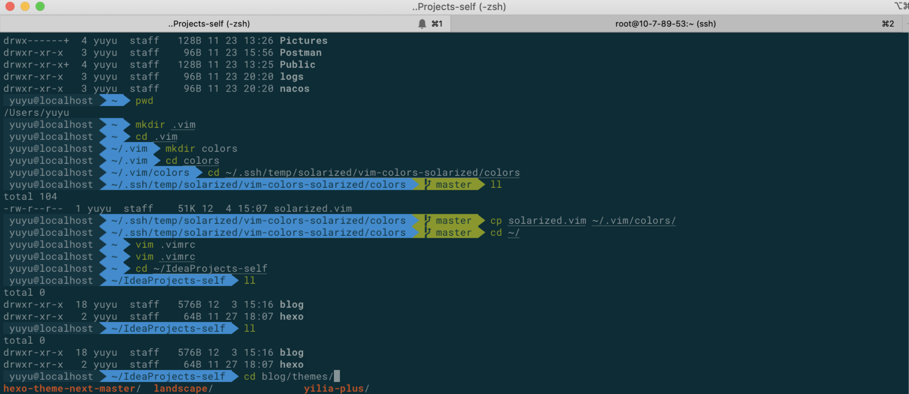
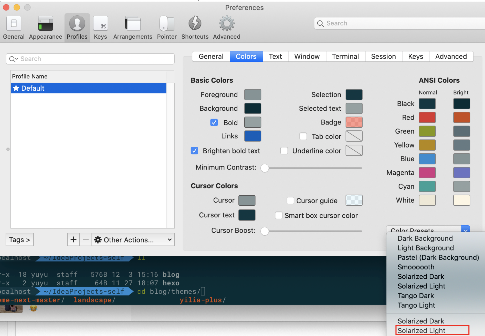
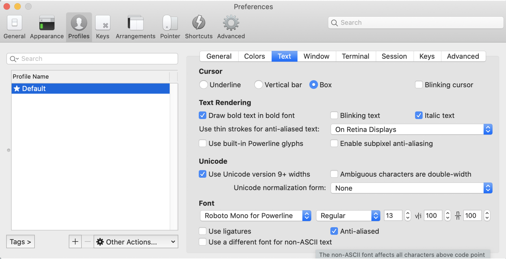

# 花里胡哨



<!--more-->

# 终端模拟器

选用 [solarized](http://ethanschoonover.com/solarized)，下载解压，然后打开 iTerm2 下的偏好设置 preference ，点开 profiles 下的 colors 选项，点击右下角的 Color Presets 选项，选择 import ，导入解压到的 solarized 文件下的 Solarized Dark.itermcolors




# 主题

## zsh

zsh 是一款强大的虚拟终端，是 Oh My Zsh 的爸爸，所以需要先装它。
在命令行输入：

```bash
zsh --version
```

如果输入 zsh 的当前版本号就说明装好了，一般 Mac 自带有的
如果没装则需要输入：

```bash
brew install zsh zsh-completions
```

这是用 Homebrew 装，需要 Mac 上有 Homebrew，它的网站：[https://brew.sh/](https://brew.sh/)

## Oh My Zsh

Oh My Zsh 是基于 zsh 的一个扩展工具集，它提供了丰富的扩展功能
它可以通过`curl`或者`wget`来安装

- via curl

```bash
sh -c "$(curl -fsSL https://raw.githubusercontent.com/robbyrussell/oh-my-zsh/master/tools/install.sh)"
```

- via wget

```bash
sh -c "$(wget https://raw.githubusercontent.com/robbyrussell/oh-my-zsh/master/tools/install.sh -O -)"
```

装好之后就可以换到 agnoster 主题，就是之前看到的那张颜值主题，Oh My Zsh 一般自带有这个主题。
可以看看它的默认主题：

```bash
ls ~/.oh-my-zsh/themes
```

需要修改主题只需：

```bash
vim ~/.zshrc
```

然后把里面 `ZSH_THEME` 的值改为 `ZSH_THEME="agnoster"`，保存退出
（[点击这里](https://github.com/robbyrussell/oh-my-zsh/wiki/Themes#agnoster)还有各种主题，任君翻牌~）
应用配置：

```bash
chsh -s /bin/zsh
```

重启 iTerm2
打开后会发现, 乱码了... 别急继续下一步

## Powerline

Git 下来安装：

```bash
git clone git@github.com:powerline/fonts.git
cd fonts
./install.sh
```

然后到 iterm2 配置，设置字体为`Roboto Mono for Powerline`：



# 自动提示与命令补全

比 iTerm2 自带的更强大的命令提示与补全

1. 克隆仓库到本地 ~/.oh-my-zsh/custom/plugins 路径下

```bash
git clone git://github.com/zsh-users/zsh-autosuggestions $ZSH_CUSTOM/plugins/zsh-autosuggestions
```

2. 用 vim 编辑 .zshrc 文件，找到插件设置命令，默认是 `plugins=(git)` ，我们把它修改为`plugins=(zsh-autosuggestions git)`

PS：当你重新打开终端时可能看不到变化，可能你的字体颜色太淡了，我们把其改亮一些：

1. `cd ~/.oh-my-zsh/custom/plugins/zsh-autosuggestions`
1. 用 vim 编辑 zsh-autosuggestions.zsh 文件，修改`ZSH_AUTOSUGGEST_HIGHLIGHT_STYLE='fg=10'`

# 语法高亮效果

1. 使用 homebrew 包管理工具安装 zsh-syntax-highlighting 插件
   `brew install zsh-syntax-highlighting`
   如果电脑上还没有安装 homebrew，请先安装 homebrew

```bash
/usr/bin/ruby -e "$(curl -fsSL https://raw.githubusercontent.com/Homebrew/install/master/install)"
```

2. 配置.zshrc 文件，插入一行

```bash
source /xxx/zsh-syntax-highlighting/zsh-syntax-highlighting.zsh
注: /xxx/ 代表.zshrc所在的路径
source ~/.zshrc
```

3. 重新打开 iTerm2 窗口（或新打开一个 iTerm2 窗口）即可以看到效果

# vim 效果

Solarized 是个很牛逼的配色项目，主流 OS、IDE、Editor 都有它影子。

```
# git下Solarized 的源码
git clone git://github.com/altercation/solarized.git
# 进入文件夹
cd solarized/vim-colors-solarized/colors
#下面可能要管理员权限
sudo mkdir -p ~/.vim/colors
sudo cp solarized.vim ~/.vim/colors/
# 创建.vimrc文件
sudo vim ~/.vimrc
# 把下面这三行复制进去
syntax enable
set background=dark
colorscheme solarized
```

然后保存 .vimrc, 退出

# 扩展

- iTerm2 默认使用 dash 改用 zsh 解决方法：`chsh -s /bin/zsh`
- iTerm2 zsh 切换回原来的 dash：`chsh -s /bin/bash`
- 卸载`oh my zsh`，在命令行输入：`uninstall_oh_my_zsh`
- 路径前缀的 XX@XX 太长，缩短问题：
  编辑`~/.oh-my-zsh/themes/agnoster.zsh-theme`主体文件，将里面的`build_prompt`下的`prompt_context`字段在前面加`#`注释掉即可

# 转载自

1. [漂亮的 Mac 终端](https://blog.csdn.net/huihut/article/details/61418136)
1. [Mac 终端配置，DIY 你的 Terminal](https://www.jianshu.com/p/95f68e035f33)
