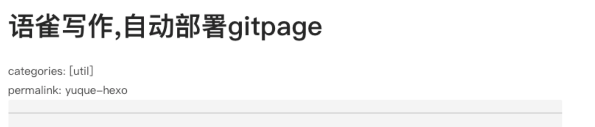

# 前言

> 先说一下我之前从写博客到发布的过程
>
> 1. 语雀写 md 文档是真的爽, 我写博客一般先在语雀写, 图片也直接复制至语雀
> 2. 写完后再从语雀导出, 然后将图片一个一个下载到本地项目中,然后在 md 文档中进行替换
> 3. 上传至 github, 并部署 gitPage
>    过程十分麻烦, 特别是将图片保存到本地特别痛苦, 然后就想到是否可以将语雀文章通过直接同步至 hexo,经过一番周折终于搞出来了, 惬意~

<!--more-->

# 涉及到的工具

1. hexo
1. yuque-hexo 项目 [https://github.com/x-cold/yuque-hexo](https://github.com/x-cold/yuque-hexo)
1. github
1. gitpage
1. travis-ci (持续集成服务)
1. 语雀

# 步骤

1. 第一版是按照 [hexo 博客终极玩法](https://www.yuque.com/u46795/blog/dlloc7#b740fe7a) 来搭建的, 不过身为技术小白, 搞不太懂里面的功能,很多地方写的很模糊
1. 上面那个先看看, 然后看[戴爱玲的博客](http://www.daiailing.cn/2020/02/22/yuque/%E4%B8%89%E3%80%81%E8%AF%AD%E9%9B%80%E5%86%99%E4%BD%9C%EF%BC%8C%E8%87%AA%E5%8A%A8%E9%83%A8%E7%BD%B2%E6%9C%8D%E5%8A%A1%E5%99%A8/) , 这篇写的特别详细

**嗯, 照着上面弄就能弄出来, 就不写了, 反正是前端的东西 QAQ**
用了两天, 经常会报错, GitHub 地址无法解析, 放弃了, 我删除了语雀调用腾讯云函数的链接, 并把`.travis.yml`文件中的`script:`中参数修改为了`hexo g`, 不再自动同步语雀内容.
现在的流程是:

1. 语雀写博客
1. 在本地运行`yuque-hexo sync` 进行同步
1. 提交代码至 github, `travis-ci`自动部署页面

# 头信息问题

当然下面的三个`-`回车后显示变了也是可以的
